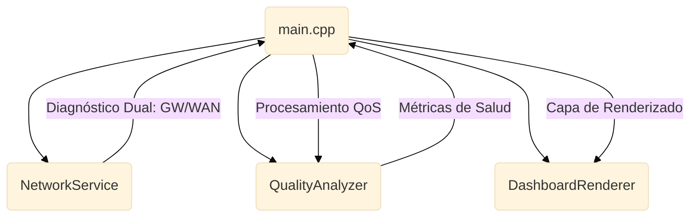

# WiFi Quality Monitor (ESP32-C6)
## Monitor de Diagnóstico de Red con Arquitectura Modular


Firmware de diagnóstico para el **WaveShare ESP32-C6-LCD-1.47**. El sistema implementa un monitoreo de doble capa (local y externa) para la detección de cuellos de botella en infraestructuras de red inalámbrica.


---

## Especificaciones y Capacidades

- **Diagnóstico Dual (LAN/WAN)**: Monitoreo de latencia independiente al Gateway local (`WiFi.gatewayIP()`) y a servidores externos (`8.8.8.8`).
- **Lógica de Calidad (QoS)**: Cálculo de salud de red basado en promedios móviles (10 muestras) para RSSI y Latencia.
- **Resiliencia**: Implementación de **Watchdog Timer (WDT)** configurado a 15s y lógica de reconexión con **Exponential Backoff** (10s a 300s).
- **Renderizado**: Gestión de pantalla vía LovyanGFX con Double Buffering para evitar parpadeos en actualizaciones de alta frecuencia.

---

## Algoritmo de Calidad (Ecuación QoS)

El puntaje de salud (`score`) se calcula mediante la ponderación de dos factores críticos:

$$Quality Score = (RSSI_{score} \times 0.6) + (Latency_{score} \times 0.4)$$

- **RSSI Score**: Mapeado lineal de -95dBm (0%) a -50dBm (100%).
- **Latency Score**: Mapeado inverso de 500ms (0%) a 50ms (100%).

### Cumplimiento de Estándares y Referencias

Para garantizar la fiabilidad del diagnóstico, el sistema se alinea con los siguientes marcos técnicos:

*   **IEEE 802.11ax (Wi-Fi 6):** Aprovechamiento de la eficiencia en entornos densos y gestión de energía.
*   **IEEE 802.11k/v/r:** Preparación técnica para gestión de recursos de radio y roaming asistido.
*   **ITU-T G.1010:** Definición de umbrales de latencia y jitter para servicios interactivos de baja latencia.
*   **RFC 792 (ICMP):** Implementación estándar de eco-request para mediciones de latencia WAN sin overhead.

---

## Ejemplo de Salida de Datos (JSON)

Estructura lista para integración con **Brokers MQTT** o bases de datos NoSQL (**InfluxDB/Grafana**):

```json
{
  "device_id": "ESP32C6_0D90",
  "status": "CONNECTED",
  "metrics": {
    "rssi": -63,
    "latency_lan": 4,
    "latency_wan": 32,
    "stability_jitter": 3,
    "reliability_rate": 0.2
  },
  "health": {
    "score": 86,
    "state": "GOOD"
  }
}
```

---

## Arquitectura del Sistema



---

## Guía de Interpretación Operativa

| Estado | Rango | Interpretación | Acción Sugerida |
| :--- | :---: | :--- | :--- |
| **EXCELLENT** | 91-100 | Enlace óptimo. | Ninguna. |
| **GOOD** | 71-90 | Enlace estable. | Monitoreo rutinario. |
| **DEGRADED** | 41-70 | Interferencia o congestión. | Revisar canal o posición. |
| **CRITICAL** | < 40 | Enlace inestable/caído. | Acción inmediata: HW/Cable. |

---

## Limitaciones Técnicas (Caveats)

Este dispositivo es una herramienta de diagnóstico de capa de aplicación y transporte. **No realiza:**
1. **Análisis de Espectro RF**: No detecta interferencias en niveles físicos de radio.
2. **Medición de Throughput**: El sistema no realiza pruebas de ancho de banda (Speedtest).
3. **Sensores de Hardware**: No incluye medición de temperatura o voltaje industrial.

---

## Benchmarks de Resiliencia

| Métrica | Valor | Certificación |
| :--- | :--- | :---: |
| **Stability Test** | > 168h Continuas | Passed |
| **Uptime Management**| Hardware Watchdog | Active |
| **State Stability** | Hysteresis (5 pts) | Active |

---

## Desarrollo y Metodología

Estructurado mediante un flujo de trabajo asistido por LLM (Antigravity), priorizando la consistencia arquitectónica sobre la codificación manual.

- **v2.1**: Optimización de WDT y diagnóstico LAN/WAN.
- **v2.0**: Implementación de historial gráfico fluido.
- **v1.0**: Prototipo base de conectividad.

---

## Instalación

1. **Configurar Credenciales**: Renombrar `.env.example` a `.env` y configurar las credenciales de red.
2. **Compilación y Carga**: Usar PlatformIO (`pio run --target upload`).
