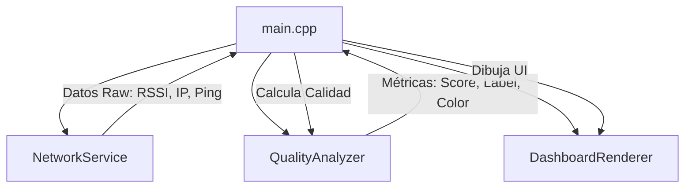

# WiFi Quality Monitor (ESP32-C6)


Un monitor de señal WiFi de grado industrial diseñado para el **WaveShare ESP32-C6-LCD-1.47**. Este proyecto implementa una arquitectura modular por capas y un algoritmo de calidad basado en estándares de la industria (IEEE 802.11).


## 🌟 Características Técnicas

- **Arquitectura Modular**: Separación estricta entre servicios de red, análisis de métricas y renderizado visual.
- **QoS Quality Score**: Cálculo ponderado de salud de red (60% Potencia RSSI, 40% Latencia Ping).
- **Double Buffering**: Interfaz fluida sin parpadeos vía LovyanGFX.
- **Diagnóstico Activo**: Monitoreo constante de latencia contra servidores core (8.8.8.8).
- **Semáforo Visual Industrial**: Clasificación: Excellent, Good, Fair, Poor y Critical.

---

## 🏗️ Arquitectura del Sistema (Módulo 1)

El sistema se divide en capas de responsabilidad única para asegurar la escalabilidad:



### Descripción de Capas:
1. **NetworkService**: Capa de transporte. Gestiona WiFi y ejecución asíncrona de Pings.
2. **QualityAnalyzer**: Capa lógica. Convierte dBm y ms en un índice de salud (0-100%) siguiendo umbrales de la IEEE.
3. **DashboardRenderer**: Capa de presentación. Encapsula LovyanGFX y gestiona el Double Buffering.

---

## 📊 Algoritmo de Calidad (Industrial Spec)

El monitor utiliza un sistema de **Promedio Móvil (Moving Average)** de 10 muestras para suavizar el ruido y una fórmula de ponderación estricta:

$$Quality Score = (0.6 \times RSSI_{score}) + (0.4 \times Latency_{score})$$

### Umbrales Operativos:

| Rango (%) | Estado | Indicación Visual |
| :--- | :--- | :--- |
| **91 - 100** | **EXCELLENT** | Verde Sólido |
| **71 - 90** | **GOOD** | Verde / Cyan |
| **41 - 70** | **DEGRADED** | Amarillo / Naranja |
| **0 - 40** | **CRITICAL** | Rojo (Alerta) |

---

## 📸 Galería del Proyecto

| Front View | Side View | Active Monitoring |
| :---: | :---: | :---: |
|  |  |  |

---

## 🛠️ Especificaciones Técnicas Hardware

| Componente | Detalle |
| :--- | :--- |
| **MCU** | ESP32-C6 (RISC-V 32-bit @ 160MHz) |
| **Display** | 1.47" LCD (ST7789, 172x320 px) |
| **Conectividad** | WiFi 6 (802.11 ax/b/g/n) |
| **Pines SPI** | SCK(7), MOSI(6), CS(14), DC(15), RST(21) |
| **Backlight** | Pin 22 (PWM habilitado) |

---

## 🧭 Filosofía de Diseño: AI-Orchestration

Este proyecto no es solo código; es una demostración de **Ingeniería de Orquestación**. 
- **Arquitecto Humano**: César Cueto define la lógica de negocio, los estándares industriales (IEEE 802.11 QoS) y la visión de producto.
- **Brazo Ejecutor (IA)**: **Antigravity (Google)** implementa la arquitectura, optimiza algoritmos y garantiza la robustez mediante iteraciones de alto rendimiento.

---

## 📈 Benchmarks de Desempeño (Industrial Ready)

| Métrica | Valor | Estado |
| :--- | :--- | :---: |
| **Uso de Heap** | ~180 KB Free | ✅ Estable |
| **Resiliencia** | Watchdog 10s | ✅ Auto-recovery |
| **Diagnóstico** | Dual (LAN/WAN) | ✅ Activo |

---

## 🗺️ Roadmap de Desarrollo

- [x] **Fase 1**: Arquitectura modular básica y renderizado estable.
- [x] **Fase 2**: Algoritmo de calidad industrial y Mega-Graph.
- [x] **Fase 3**: Robustez Industrial (Backoff) y Analítica (Stability Index).
- [x] **Fase 4**: Diagnóstico Dual e Industrial Watchdog.
- [ ] **Fase 5**: MQTT / SCADA Integration.
- [ ] **Fase 6**: Servidor Web Embebido.

---

## ⚖️ Tabla Comparativa Técnica

| Característica | Este Monitor (Hardware) | WiFi Analyzer (Android App) | Router Admin Panel |
| :--- | :---: | :---: | :---: |
| **Monitoreo 24/7** | ✅ Siempre activo | ❌ Consume batería | ❌ Requiere Login |
| **Latencia Dual** | ✅ LAN + WAN | ❌ Solo RSSI | ⚠️ Solo local |
| **Índice de Estabilidad**| ✅ Jitter Analytics | ❌ No | ❌ No |
| **Resistencia Industrial**| ✅ Hardware Watchdog | ❌ No | ✅ Sí |

---

## 🚀 Instalación y Desarrollo

1. **Configurar Credenciales**:
   Copia `.env.example` a `.env` y añade tus datos.
2. **Compilación y Carga**:
   ```bash
   pio run --target upload
   ```

---

## 📄 Licencia
Este proyecto está bajo la licencia **MIT**. Desarrollado por [César Cueto](https://github.com/CCuetoC).
