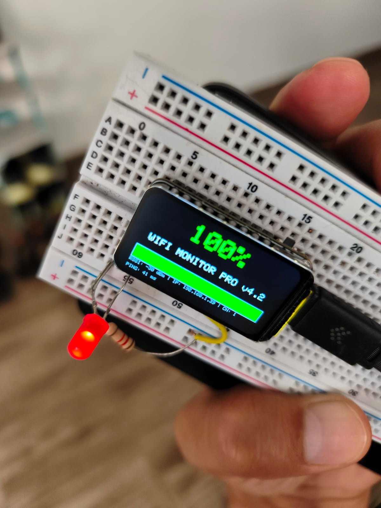
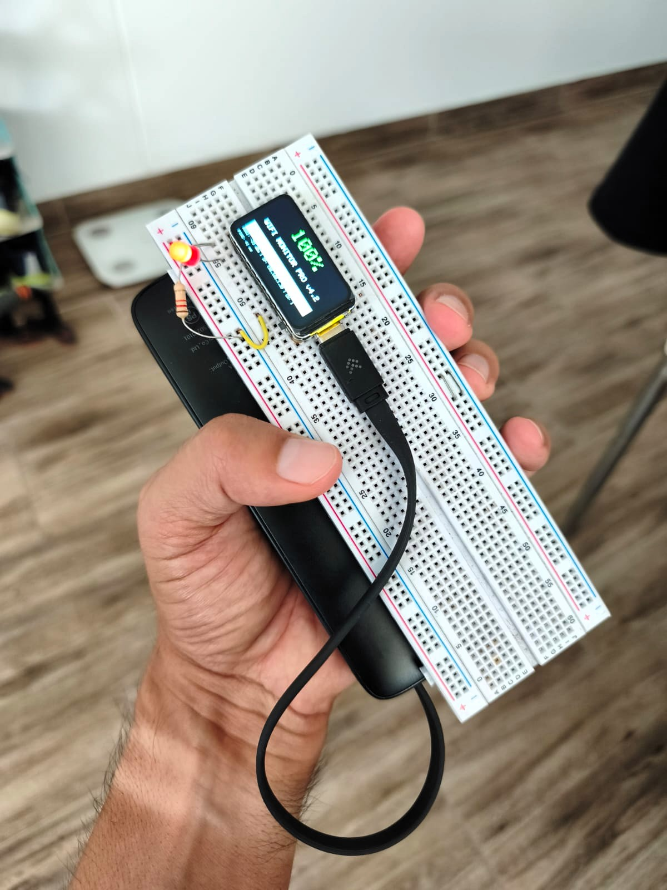
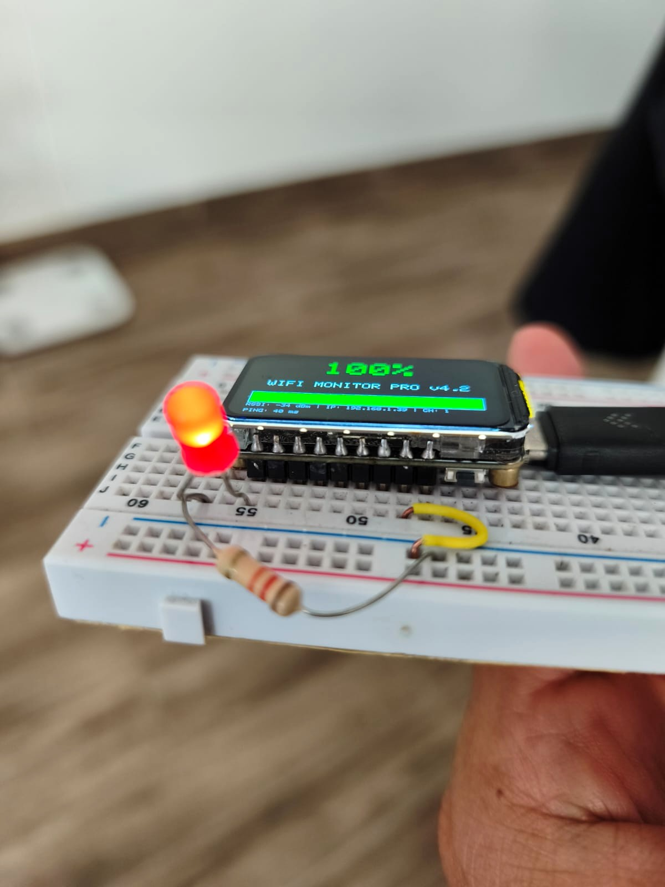

# WiFi Quality Monitor (ESP32-C6)


Un monitor de señal WiFi diseñado para el **WaveShare ESP32-C6-LCD-1.47**. Optimizado con **Double Buffering** mediante la librería LovyanGFX para una fluidez excepcional.



## 🌟 Características

- **Monitoreo en Tiempo Real**: Visualización de precisión de RSSI (dBm) y porcentaje de calidad.
- **Double Buffering (Buffer Doble)**: Gestión de memoria mediante Sprites para una interfaz sin parpadeo.
- **Diagnóstico Activo**: Prueba de Ping automática a los DNS de Google (8.8.8.8) cada 5 segundos.
- **Semáforo Visual**: Codificación de colores (Verde > 80%, Amarillo > 40%, Rojo < 40%).
- **Observabilidad Física**: LED externo sincronizado con la calidad de la señal.
- **Arquitectura Segura**: Carga de credenciales mediante variables de entorno (`.env`).

---

## 📸 Galería del Proyecto

| Front View | Side View | Active Monitoring |
| :---: | :---: | :---: |
|  |  |  |

---

## 🛠️ Especificaciones Técnicas

| Componente | Detalle |
| :--- | :--- |
| **MCU** | ESP32-C6 (RISC-V 32-bit @ 160MHz) |
| **Display** | 1.47" LCD (ST7789, 172x320 px) |
| **Driver Gráfico** | LovyanGFX v1.1.16 |
| **Conectividad** | WiFi 6 (802.11 ax/b/g/n) |
| **Pines SPI** | SCK(7), MOSI(6), CS(14), DC(15), RST(21) |
| **Backlight** | Pin 22 (PWM habilitado) |

### Pinout de Referencia


---

## 🚀 Instalación y Desarrollo

### Herramientas Recomendadas
Este proyecto ha sido desarrollado utilizando **Antigravity de Google**, un entorno de IA basado en la arquitectura de VS Code optimizado para el "Vibe Coding" y el desarrollo rápido de hardware.

### Flujo de Configuración
1. **Clonar e instalar dependencias**:
   ```bash
   git clone https://github.com/CCuetoC/wifi-quality-monitor-esp32c6.git
   ```
2. **Gestionar Secretos**:
   Renombra `.env.example` a `.env` y añade tus credenciales. **Nunca subas tu archivo `.env` al repositorio público.**
   ```env
   WIFI_SSID="TU_RED"
   WIFI_PASS="TU_CONTRASEÑA"
   ```
3. **Compilar y Flashear**:
   Utiliza el comando de PlatformIO:
   ```bash
   pio run --target upload
   ```

---

## 🛡️ Seguridad y Buenas Prácticas

> [!IMPORTANT]
> **Gestión de Credenciales**: El proyecto utiliza un `env_loader.py` que inyecta automáticamente las variables del archivo `.env` como banderas de compilación. Esto mantiene tus credenciales fuera del binario compartido y del historial de Git.

- Se utiliza un `.gitignore` robusto siguiendo los estándares de la industria para evitar archivos temporales en el repositorio.
- El uso de **Double Buffering** no solo mejora la estética, sino que reduce el consumo de energía al minimizar los ciclos de refresco de pantalla innecesarios.

---

## 📄 Licencia

Este proyecto está bajo la licencia **MIT**. Desarrollado por [César Cueto](https://github.com/CCuetoC).

---
*Standalone project designed for exploring high-speed hardware integration.*
