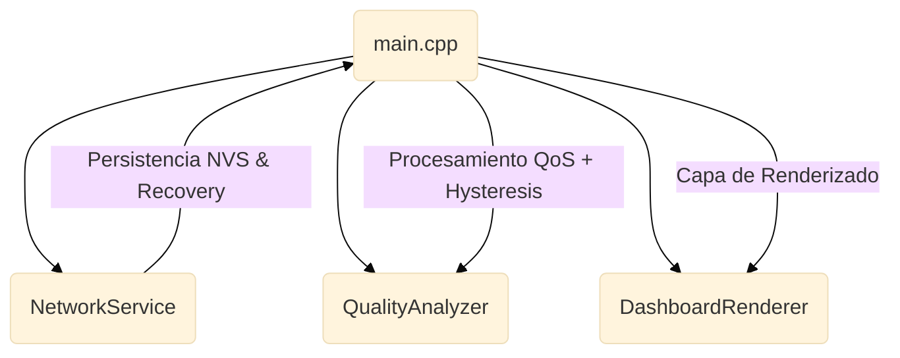

# WiFi Quality Monitor (ESP32-C6)
## Monitor de Diagnóstico de Red con Confiabilidad Industrial

Firmware de diagnóstico profesional para el **WaveShare ESP32-C6-LCD-1.47**. Este sistema transforma el ESP32 en un instrumento de auditoría de red de largo plazo, capaz de persistir métricas de salud y auto-recuperarse ante fallos críticos de infraestructura.

---

## Confiabilidad Industrial Real (Módulo 8)

A diferencia de monitores convencionales, este sistema está diseñado para la autonomía total:

- **Persistencia Acumulativa (NVS)**: El sistema registra el **Uptime Total** y el **Historial de Desconexiones** en la memoria no volátil (NVS). Las métricas sobreviven a cortes de energía o reinicios, permitiendo diagnósticos de "24h" y análisis de tendencias semanales reales.
- **Auto-Recovery (Watchdog de Red)**: Implementa un ciclo de recuperación automática. Si la infraestructura WiFi falla por más de 15 minutos, el sistema ejecuta un `ESP.restart()` controlado para re-inicializar el stack de red y evitar bloqueos lógicos.
- **Métrica LT-DR (Long-Term Disconnect Rate)**: Proporciona una tasa de desconexión promedio calculada sobre toda la vida útil del dispositivo, ideal para auditorías de estabilidad de ISP.

---

## Especificaciones Técnicas

- **Diagnóstico Dual (LAN/WAN)**: Monitoreo ICMP alternativo al Gateway local y DNS externo.
- **Resiliencia**: Watchdog de hardware (15s) y Watchdog de red (15m).
- **Aesthetics**: Interfaz "Trend-First" con gráfico de tendencia de 10s (50 muestras) y Double Buffering.

---

## Arquitectura del Sistema

---

## Instalación

1. **Configuración de Red**: Copiar `src/config.h.example` a `src/config.h` y completar las credenciales.
2. **Carga de Firmware**: Usar PlatformIO (`pio run --target upload`).

---

## Licencia
Proyecto bajo licencia MIT. Desarrollado por [César Cueto](https://github.com/CCuetoC).
