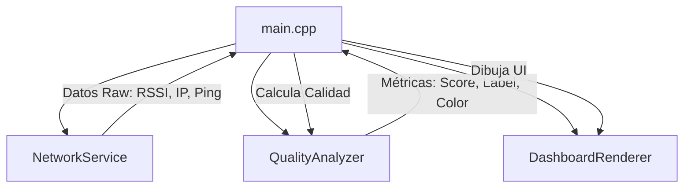

# WiFi Quality Monitor (ESP32-C6)


Un monitor de señal WiFi de grado industrial diseñado para el **WaveShare ESP32-C6-LCD-1.47**. Este proyecto implementa una arquitectura modular por capas y un algoritmo de calidad basado en estándares de la industria (IEEE 802.11).


## 🌟 Características Técnicas

- **Arquitectura Modular**: Separación estricta entre servicios de red, análisis de métricas y renderizado visual.
- **QoS Quality Score**: Cálculo ponderado de salud de red (60% Potencia RSSI, 40% Latencia Ping).
- **Double Buffering**: Interfaz fluida sin parpadeos vía LovyanGFX.
- **Diagnóstico Activo**: Monitoreo constante de latencia contra servidores core (8.8.8.8).
- **Semáforo Visual Industrial**: Clasificación: Excellent, Good, Fair, Poor y Critical.

---

## 🏗️ Arquitectura del Sistema (Módulo 1)

El sistema se divide en capas de responsabilidad única para asegurar la escalabilidad:



### Descripción de Capas:
1. **NetworkService**: Capa de transporte. Gestiona WiFi y ejecución asíncrona de Pings.
2. **QualityAnalyzer**: Capa lógica. Convierte dBm y ms en un índice de salud (0-100%) siguiendo umbrales de la IEEE.
3. **DashboardRenderer**: Capa de presentación. Encapsula LovyanGFX y gestiona el Double Buffering.

---

## 📊 Algoritmo de Calidad (IEEE/Industrial)

A diferencia de los medidores básicos, este monitor utiliza una ponderación:

| Métrica | Peso | Umbral Excelente | Umbral Crítico |
| :--- | :--- | :--- | :--- |
| **RSSI** | 60% | > -50 dBm | < -90 dBm |
| **Latencia** | 40% | < 50 ms | > 500 ms |

---

## 📸 Galería del Proyecto

| Front View | Side View | Active Monitoring |
| :---: | :---: | :---: |
|  |  |  |

---

## 🛠️ Especificaciones Técnicas Hardware

| Componente | Detalle |
| :--- | :--- |
| **MCU** | ESP32-C6 (RISC-V 32-bit @ 160MHz) |
| **Display** | 1.47" LCD (ST7789, 172x320 px) |
| **Conectividad** | WiFi 6 (802.11 ax/b/g/n) |
| **Pines SPI** | SCK(7), MOSI(6), CS(14), DC(15), RST(21) |
| **Backlight** | Pin 22 (PWM habilitado) |

---

## 🚀 Instalación y Desarrollo

Desarrollado en **Antigravity (Google)**. 

1. **Configurar Credenciales**:
   Copia `.env.example` a `.env` y añade tus datos.
2. **Compilación y Carga**:
   ```bash
   pio run --target upload
   ```

---

## 📄 Licencia
Este proyecto está bajo la licencia **MIT**. Desarrollado por [César Cueto](https://github.com/CCuetoC).
