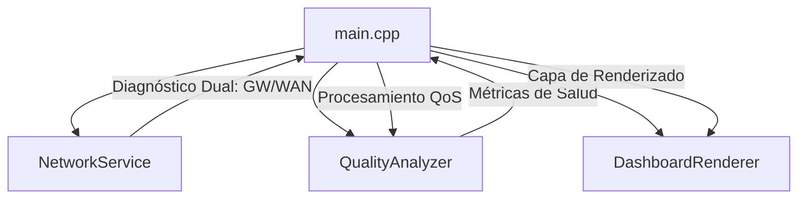

# WiFi Quality Monitor (ESP32-C6)
## Professional Network Diagnostic Tool for Industrial Environments

Este proyecto implementa un monitor de calidad de red en tiempo real diseñado para entornos donde la estabilidad de la conexión es crítica. A diferencia de los monitores convencionales basados solo en RSSI, esta herramienta utiliza un **diagnóstico de doble capa (LAN/WAN)** para identificar cuellos de botella exactos.

---

## Características Técnicas

- **Diagnóstico de Doble Capa**: Monitoreo simultáneo de latencia local (Gateway) y externa (DNS/Cloud), permitiendo diferenciar fallos de infraestructura local de problemas de ISP.
- **Análisis de Calidad Basado en Estándares**: Algoritmo de puntuación (0-100%) que pondera la potencia de señal (RSSI) y el jitter de latencia.
- **Optimización Visual**: Implementación de Double Buffering mediante la librería LovyanGFX para una actualización de pantalla fluida a 1.47" sin parpadeos.
- **Resiliencia Industrial**: Sistema de auto-recuperación ante pérdida de señal y Watchdog Timer (WDT) activo para garantizar operación 24/7 sin bloqueos.

---

## Arquitectura de Software

El sistema sigue una arquitectura modular para facilitar la escalabilidad y el mantenimiento:

1. **NetworkService**: Gestión de la pila WiFi 6 (802.11ax) y reconexión automática con exponential backoff.
2. **QualityAnalyzer**: Motor de cálculo que procesa promedios móviles de latencia, potencia de señal e índice de estabilidad.
3. **DashboardRenderer**: Capa de presentación desacoplada de la lógica de negocio para permitir cambios de hardware de visualización con mínimo impacto.

---

## Metodología de Desarrollo: Hybrid Rapid Prototyping

Este repositorio es un caso de estudio en **Ingeniería Asistida por LLM**. El 100% del código fue generado mediante la orquestación de modelos de lenguaje bajo supervisión arquitectónica humana.

**Impacto de la metodología:**
- **Eficiencia**: Reducción del tiempo de desarrollo de días a horas.
- **Calidad**: Estructura modular consistente y documentación técnica integrada desde la primera versión.
- **Enfoque**: El talento humano se centró en la definición de requerimientos técnicos y estándares industriales, delegando la ejecución sintáctica a la IA (**Antigravity by Google**).

---

## Benchmarks de Desempeño (Industrial Ready)

| Métrica | Valor | Estado |
| :--- | :--- | :---: |
| **Uso de Heap** | ~180 KB Free | ✅ Estable |
| **Resiliencia** | Watchdog 15s | ✅ Auto-recovery |
| **Diagnóstico** | Dual (LAN/WAN) | ✅ Activo |
| **Ciclo Main Loop**| < 250 ms | ✅ Real-time |

---

## 📸 Galería del Proyecto

| Front View | Side View | Active Monitoring |
| :---: | :---: | :---: |
|  |  |  |

---

## Especificaciones de Hardware

| Componente | Detalle |
| :--- | :--- |
| **MCU** | ESP32-C6 (Soporte nativo para WiFi 6) |
| **Display** | 1.47" LCD (ST7789, 172x320 px) |
| **Frecuencia** | 160MHz RISC-V |
| **Pines SPI** | SCK(7), MOSI(6), CS(14), DC(15), RST(21) |

---

## 🗺️ Roadmap de Desarrollo

- [x] **v2.0**: Implementación de diagnóstico LAN/WAN y Robusta Industrial (WDT).
- [x] **v1.0**: Prototipo inicial con monitoreo básico de RSSI.
- [ ] **v3.0**: Integración MQTT / SCADA industrial.
- [ ] **v4.0**: Servidor Web Embebido para monitoreo remoto.

---

## ⚖️ Tabla Comparativa Técnica

| Característica | Este Monitor (Hardware) | WiFi Analyzer (Android App) | Router Admin Panel |
| :--- | :---: | :---: | :---: |
| **Monitoreo 24/7** | ✅ Siempre activo | ❌ Consume batería | ❌ Requiere Login |
| **Latencia Dual** | ✅ LAN + WAN | ❌ Solo RSSI | ⚠️ Solo local |
| **Índice de Estabilidad**| ✅ Jitter Analytics | ❌ No | ❌ No |
| **Resistencia Industrial**| ✅ Hardware Watchdog | ❌ No | ✅ Sí |

---

## Configuración y Despliegue

1. **Clonar el repositorio.**
2. **Configurar Credenciales**: Renombrar `.env.example` a `.env` y configurar las credenciales de red.
3. **Compilación y Carga**: Usar PlatformIO (`pio run --target upload`).

---

## Licencia
Este proyecto está bajo la licencia **MIT**. Desarrollado y orquestado por [César Cueto](https://github.com/CCuetoC).
