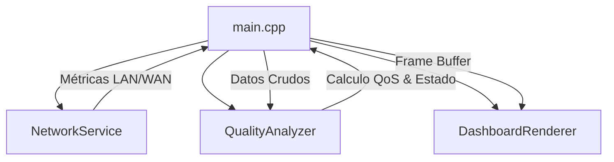

# WiFi Quality Monitor (ESP32-C6)
## Monitor de Diagnóstico de Red con Arquitectura Modular


Firmware de diagnóstico para el **WaveShare ESP32-C6-LCD-1.47**. El sistema implementa un monitoreo de doble capa (local y externa) para la detección de cuellos de botella en infraestructuras de red inalámbrica.


---

## Especificaciones y Capacidades

- **Diagnóstico Dual (LAN/WAN)**: Monitoreo de latencia independiente al Gateway local (`WiFi.gatewayIP()`) y a servidores externos (`8.8.8.8`).
- **Lógica de Calidad (QoS)**: Cálculo de salud de red basado en promedios móviles (10 muestras) para RSSI y Latencia.
- **Resiliencia**: Implementación de **Watchdog Timer (WDT)** configurado a 15s y lógica de reconexión con **Exponential Backoff** (10s a 300s).
- **Renderizado**: Gestión de pantalla vía LovyanGFX con Double Buffering para evitar parpadeos en actualizaciones de alta frecuencia.

---

## Algoritmo de Calidad (Ecuación QoS)

El puntaje de salud (`score`) se calcula mediante la ponderación de dos factores críticos:

$$Quality Score = (RSSI_{score} \times 0.6) + (Latency_{score} \times 0.4)$$

- **RSSI Score**: Mapeado lineal de -95dBm (0%) a -50dBm (100%).
- **Latency Score**: Mapeado inverso de 500ms (0%) a 50ms (100%).

---

## Ejemplo de Salida de Datos (JSON)

Para facilitar integraciones futuras, el sistema procesa los datos bajo la siguiente estructura:

```json
{
  "device_id": "ESP32C6_0D90",
  "status": "CONNECTED",
  "metrics": {
    "rssi": -63,
    "latency_lan": 4,
    "latency_wan": 32,
    "stability_jitter": 3
  },
  "health": {
    "score": 86,
    "state": "GOOD"
  }
}
```

---

## 🏗️ Arquitectura del Sistema



---

## 🚫 Limitaciones Técnicas (Caveats)

Este dispositivo es una herramienta de diagnóstico de capa de aplicación y transporte. **No realiza:**
1. **Análisis de Espectro RF**: No detecta interferencias en canales adyacentes a nivel físico.
2. **Medición de Throughput**: El sistema no realiza pruebas de ancho de banda (Upload/Download speed).
3. **Detección de Packet Loss**: La métrica actual se basa en latencia de ICMP Echo; no contabiliza pérdida de paquetes a largo plazo.

---

## 🗺️ Desarrollo y Metodología

Estructurado mediante un flujo de trabajo asistido por LLM (Antigravity), priorizando la consistencia arquitectónica sobre la codificación manual.

- **v2.1**: Optimización de WDT y diagnóstico LAN/WAN.
- **v2.0**: Implementación de historial gráfico fluido.
- **v1.0**: Prototipo base de conectividad.

---

## 🚀 Instalación
1. Renombrar `.env.example` a `.env`.
2. Configurar credenciales.
3. Cargar mediante PlatformIO (`pio run -t upload`).
