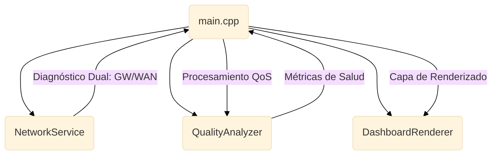

# WiFi Quality Monitor (ESP32-C6)
## Monitor de Diagnóstico de Red con Arquitectura Modular


Firmware de diagnóstico profesional para el **WaveShare ESP32-C6-LCD-1.47**. Este sistema implementa un monitoreo de doble capa (local y externa) para la detección de cuellos de botella en infraestructuras inalámbricas industriales.


---

## Especificaciones y Capacidades

- **Diagnóstico Dual (LAN/WAN)**: Evaluación de latencia independiente al Gateway local y a servidores externos (DNS/Cloud).
- **Análisis de Calidad Basado en Estándares**: Algoritmo QoS que pondera RSSI y Jitter de latencia.
- **Resiliencia Industrial**: Implementación de **Watchdog Timer (WDT)** y lógica de reconexión con **Exponential Backoff**.
- **Visualización Avanzada**: Historial de tendencia integrado mediante Double Buffering (LovyanGFX).

---

## Alineación con Estándares y Diseño

El firmware está diseñado siguiendo las recomendaciones de rendimiento de la **ITU-T G.1010** para la clasificación de estados (Latencia/Jitter). Asimismo, la arquitectura aprovecha el stack nativo del ESP32-C6, permitiendo la compatibilidad futura con:
*   **IEEE 802.11ax (Wi-Fi 6):** Eficiencia en entornos de alta densidad.
*   **IEEE 802.11k/v/r:** Preparado para lógica de roaming asistido y gestión de recursos de radio.

---

## Integración y Telemetría (JSON)

El sistema está preparado para la exportación de datos en formato JSON, facilitando la integración futura con **Brokers MQTT** o bases de datos como **InfluxDB/Grafana**:

```json
{
  "device_id": "ESP32C6_XY",
  "metrics": {
    "rssi": -63,
    "latency_lan": 4,
    "latency_wan": 32,
    "stability_jitter": 3,
    "disconnect_rate": 0.2
  },
  "health": {
    "score": 86,
    "state": "GOOD"
  }
}
```

---

## Arquitectura del Sistema



---

## Guía de Interpretación Operativa

| Estado | Rango | Interpretación | Color |
| :--- | :---: | :--- | :---: |
| **EXCELLENT** | 91-100 | Enlace óptimo. | Verde |
| **GOOD** | 71-90 | Enlace estable. | Cyan |
| **DEGRADED** | 41-70 | Interferencia o congestión. | Amarillo |
| **CRITICAL** | < 40 | Enlace inestable/caído. | Rojo |

---

## Benchmarks y Roadmap

| Objetivo | Estado | Descripción |
| :--- | :--- | :--- |
| **Stability Test** | Target | Objetivo de 168h de operación continua. |
| **Hysteresis Logic**| Active | Zona muerta de 5 puntos para estabilidad visual. |
| **Low Jitter** | Active | Inicialización de buffers (Anti Cold-start). |

### Backlog de Desarrollo
- [ ] Implementación de cliente MQTT para telemetría remota.
- [ ] Servidor Web interno para configuración de parámetros QoS.
- [ ] Alertas SNMP para integración con sistemas de monitoreo IT.

---

## Instalación

1. **Configuración de Red**: Copiar `src/config.h.example` a `src/config.h` y completar las credenciales.
2. **Carga de Firmware**: Usar PlatformIO (`pio run --target upload`).

---

## Licencia
Proyecto bajo licencia MIT. Desarrollado por [César Cueto](https://github.com/CCuetoC).
